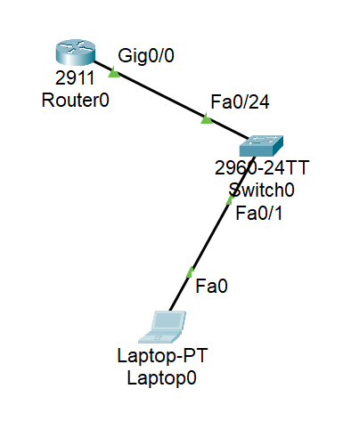
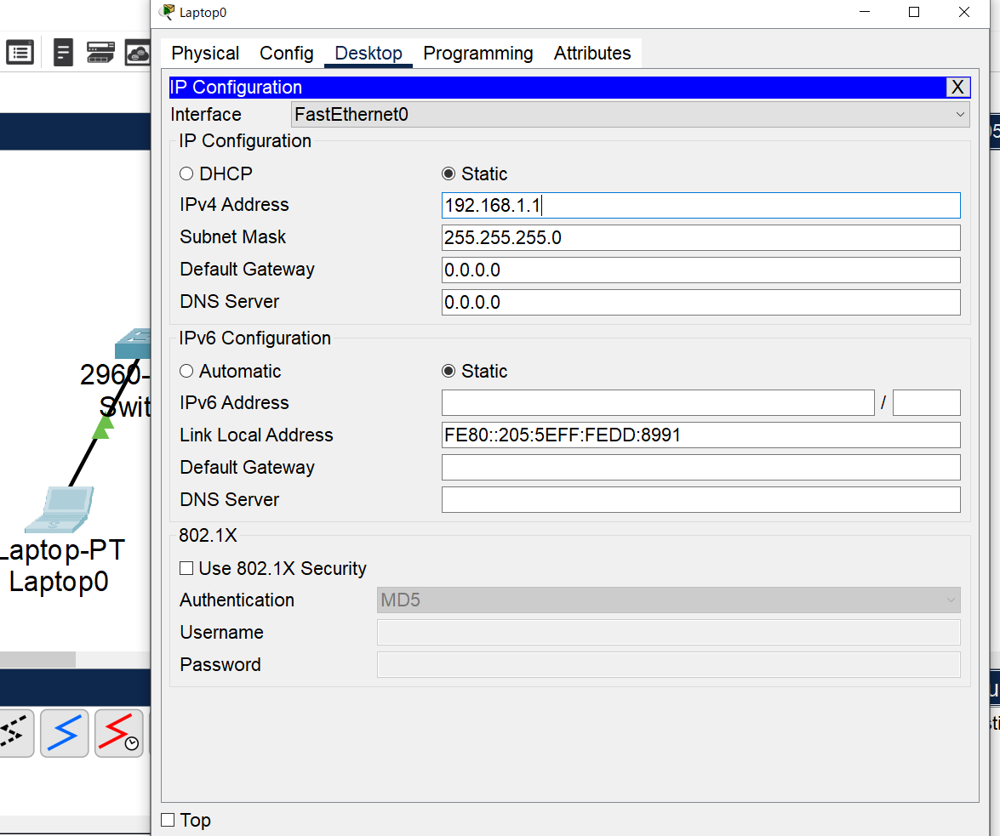
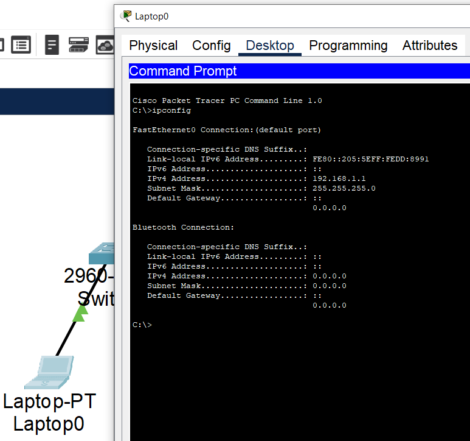
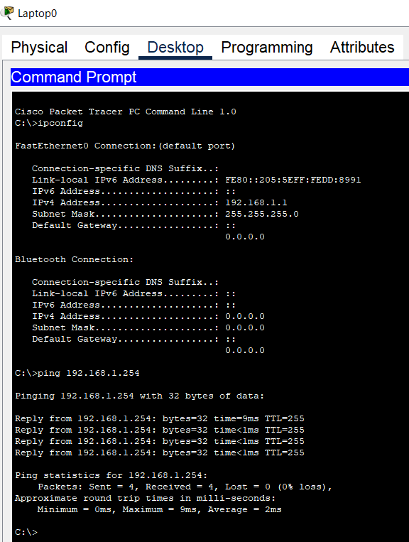
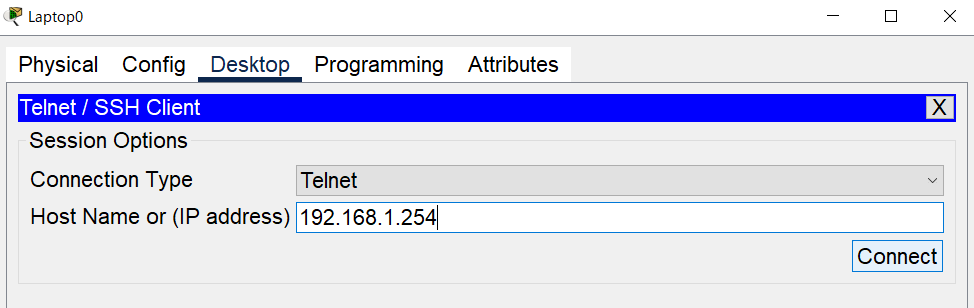
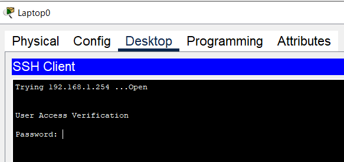
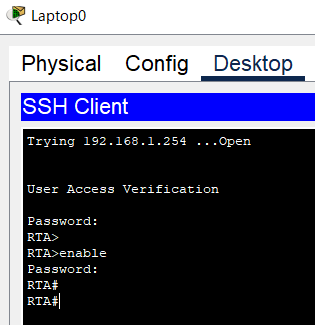

# network-portfolio
ネットワーク構築練習用ポートフォリオ
# ネットワーク構築練習用ポートフォリオ

はじめまして。 前職は映像ディレクターとして従事しておりましたが、IT業界へのキャリアチェンジを目指し、未経験からネットワークエンジニアとしてのキャリアを志望しております。 
2025年5月にCCNA（Cisco Certified Network Associate）を取得し、ネットワーク構築スキルを高めるために、Cisco Packet TracerとCisco Modeling Labsを使ってハンズオン学習を続けています。 

このリポジトリでは、「ネットワーク構築マラソン」（株式会社CAIRN 運営） の課題をベースに、構築トポロジ、設定内容、動作検証結果などをまとめています。
実務未経験ではありますが、構築の手順やトラブルシューティングの思考などを可視化することで、ポートフォリオとして採用担当者の方にスキルと姿勢を伝えられればと思っております。

## 保有資格
- CCNA（Cisco Certified Network Associate） 【2025年5月8日 取得】

## 使用ツール
- Cisco Packet Tracer
- Cisco Modeling Labs（無料版 / 5ノードまで）
- GitHub / Markdown

## 課題一覧
- task01_basic-routing：静的ルーティングの構築と疎通確認
- task02_vlan-stp：VLAN、STPの設定と検証
- task03_ospf：OSPFルーティングの構成　など

## 学習記録

### 第1回：Cisco機器の基本設定【実機検証】

#### 学習内容
- Ciscoスイッチ、ルータの基本設定（ホスト名、パスワード、IPアドレス）  
- Pingを使用したPCからルータへ疎通確認
- Telnetを使用したPCからルータへリモートログイン確認

#### 使用機器
- **ルータ**: Cisco 2911 ×1台
  - ※Cisco 891FJがなかったため、コマンド制限の少ないCisco 2911を使用
- **L2スイッチ**: Catalyst2960 ×1台
- **検証用PC**: ×1台
- **LANケーブル**: ×2本

#### 構成図


#### 設定内容

##### スイッチの設定
[完全な設定ファイルを見る](configs/session01/switch-config.txt)

**ホスト名の設定**
```
Switch>en
Switch#conf t
Enter configuration commands, one per line.  End with CNTL/Z.
Switch(config)#hostname SWA
SWA(config)#
```

**enableパスワード設定**
```
SWA(config)#enable password Cisco
SWA(config)#enable secret Cisco
The enable secret you have chosen is the same as your enable password.
This is not recommended.  Re-enter the enable secret.
SWA(config)#
```

**使用しないインターフェースの無効化（セキュリティ対策のため）**
- #show interfaces status → スイッチに存在する全てのインターフェースを確認
```
SWA#show interfaces status
Port      Name               Status       Vlan       Duplex  Speed Type
Fa0/1                        connected    1          auto    auto  10/100BaseTX
Fa0/2                        notconnect   1          auto    auto  10/100BaseTX
Fa0/3                        notconnect   1          auto    auto  10/100BaseTX
Fa0/4                        notconnect   1          auto    auto  10/100BaseTX
Fa0/5                        notconnect   1          auto    auto  10/100BaseTX
Fa0/6                        notconnect   1          auto    auto  10/100BaseTX
Fa0/7                        notconnect   1          auto    auto  10/100BaseTX
Fa0/8                        notconnect   1          auto    auto  10/100BaseTX
Fa0/9                        notconnect   1          auto    auto  10/100BaseTX
Fa0/10                       notconnect   1          auto    auto  10/100BaseTX
Fa0/11                       notconnect   1          auto    auto  10/100BaseTX
Fa0/12                       notconnect   1          auto    auto  10/100BaseTX
Fa0/13                       notconnect   1          auto    auto  10/100BaseTX
Fa0/14                       notconnect   1          auto    auto  10/100BaseTX
Fa0/15                       notconnect   1          auto    auto  10/100BaseTX
Fa0/16                       notconnect   1          auto    auto  10/100BaseTX
Fa0/17                       notconnect   1          auto    auto  10/100BaseTX
Fa0/18                       notconnect   1          auto    auto  10/100BaseTX
Fa0/19                       notconnect   1          auto    auto  10/100BaseTX
Fa0/20                       notconnect   1          auto    auto  10/100BaseTX
Fa0/21                       notconnect   1          auto    auto  10/100BaseTX
Fa0/22                       notconnect   1          auto    auto  10/100BaseTX
Fa0/23                       notconnect   1          auto    auto  10/100BaseTX
Fa0/24                       notconnect   1          auto    auto  10/100BaseTX
Gig0/1                       notconnect   1          auto    auto  10/100BaseTX
Gig0/2                       notconnect   1          auto    auto  10/100BaseTX
```
```
SWA#conf t
Enter configuration commands, one per line.  End with CNTL/Z.
SWA(config)#interface range Fa
SWA(config)#interface range FastEthernet 0/2 - 23
SWA(config-if-range)#shutdown

%LINK-5-CHANGED: Interface FastEthernet0/2, changed state to administratively down

%LINK-5-CHANGED: Interface FastEthernet0/3, changed state to administratively down

%LINK-5-CHANGED: Interface FastEthernet0/4, changed state to administratively down

%LINK-5-CHANGED: Interface FastEthernet0/5, changed state to administratively down

%LINK-5-CHANGED: Interface FastEthernet0/6, changed state to administratively down

%LINK-5-CHANGED: Interface FastEthernet0/7, changed state to administratively down

%LINK-5-CHANGED: Interface FastEthernet0/8, changed state to administratively down

%LINK-5-CHANGED: Interface FastEthernet0/9, changed state to administratively down

%LINK-5-CHANGED: Interface FastEthernet0/10, changed state to administratively down

%LINK-5-CHANGED: Interface FastEthernet0/11, changed state to administratively down

%LINK-5-CHANGED: Interface FastEthernet0/12, changed state to administratively down

%LINK-5-CHANGED: Interface FastEthernet0/13, changed state to administratively down

%LINK-5-CHANGED: Interface FastEthernet0/14, changed state to administratively down

%LINK-5-CHANGED: Interface FastEthernet0/15, changed state to administratively down

%LINK-5-CHANGED: Interface FastEthernet0/16, changed state to administratively down

%LINK-5-CHANGED: Interface FastEthernet0/17, changed state to administratively down

%LINK-5-CHANGED: Interface FastEthernet0/18, changed state to administratively down

%LINK-5-CHANGED: Interface FastEthernet0/19, changed state to administratively down

%LINK-5-CHANGED: Interface FastEthernet0/20, changed state to administratively down

%LINK-5-CHANGED: Interface FastEthernet0/21, changed state to administratively down

%LINK-5-CHANGED: Interface FastEthernet0/22, changed state to administratively down

%LINK-5-CHANGED: Interface FastEthernet0/23, changed state to administratively down
SWA(config-if-range)#exit
SWA(config)#inter
SWA(config)#interface ra
SWA(config)#interface range Gi
SWA(config)#interface range GigabitEthernet 0/1 - 2
SWA(config-if-range)#shutdown

%LINK-5-CHANGED: Interface GigabitEthernet0/1, changed state to administratively down

%LINK-5-CHANGED: Interface GigabitEthernet0/2, changed state to administratively down
SWA(config-if-range)#exit
SWA(config)#
```

**設定内容の確認**
```
SWA#show running-config
Building configuration...

Current configuration : 1388 bytes
!
version 15.0
no service timestamps log datetime msec
no service timestamps debug datetime msec
no service password-encryption
!
hostname SWA
!
enable secret 5 $1$mERr$YlCkLMcTYWwkF1Ccndtll.
enable password Cisco
!
（省略）
```

**使用しないポートの無効化の確認**
```
（省略）
!
interface FastEthernet0/1
!
interface FastEthernet0/2
 shutdown
!
interface FastEthernet0/3
 shutdown
!
interface FastEthernet0/4
 shutdown
!
interface FastEthernet0/5
 shutdown
!
（省略）
```
- Ctrl+Shift+6 → コマンド表示を中断

##### ルータの設定  
[完全な設定ファイルを見る](configs/session01/router-config.txt)

**ホスト名の設定**
```
Router>en
Router#conf t
Enter configuration commands, one per line.  End with CNTL/Z.
Router(config)#hostname RTA
```

**enableパスワード**
```
RTA(config)#enable password Cisco
RTA(config)#enable secret Cisco
The enable secret you have chosen is the same as your enable password.
This is not recommended.  Re-enter the enable secret.
RTA(config)#
```

**使用しないインターフェースの無効化（セキュリティ対策のため）**
```
RTA#show interfaces status
                     ^
% Invalid input detected at '^' marker.
	
RTA#
```
- #show interfaces status → スイッチのインターフェース（スイッチポート）の状態を確認するコマンドなので、ルータでは使用できなかった
- #show ip interface brief → ルータに存在する全てのインターフェースを確認
```
RTA#show ip interface brief
Interface              IP-Address      OK? Method Status                Protocol 
GigabitEthernet0/0     unassigned      YES unset  administratively down down 
GigabitEthernet0/1     unassigned      YES unset  administratively down down 
GigabitEthernet0/2     unassigned      YES unset  administratively down down 
Vlan1                  unassigned      YES unset  administratively down down
RTA#
```
```
RTA#conf t
Enter configuration commands, one per line.  End with CNTL/Z.
RTA(config)#interface range Gi
RTA(config)#interface range GigabitEthernet 0/1 - 2
RTA(config-if-range)#shutdown
RTA(config-if-range)#exit
RTA(config)#interface Gi
RTA(config)#interface GigabitEthernet 0/0
RTA(config-if)#no shutdown

RTA(config-if)#
%LINK-5-CHANGED: Interface GigabitEthernet0/0, changed state to up

%LINEPROTO-5-UPDOWN: Line protocol on Interface GigabitEthernet0/0, changed state to up

RTA(config-if)#end
RTA#
%SYS-5-CONFIG_I: Configured from console by console

RTA#show ip interface brief
Interface              IP-Address      OK? Method Status                Protocol 
GigabitEthernet0/0     unassigned      YES unset  up                    up 
GigabitEthernet0/1     unassigned      YES unset  administratively down down 
GigabitEthernet0/2     unassigned      YES unset  administratively down down 
Vlan1                  unassigned      YES unset  administratively down down
RTA#
```

**設定内容の確認**
```
RTA#show running-config
Building configuration...

Current configuration : 747 bytes
!
version 15.1
no service timestamps log datetime msec
no service timestamps debug datetime msec
no service password-encryption
!
hostname RTA
!
!
!
enable secret 5 $1$mERr$YlCkLMcTYWwkF1Ccndtll.
enable password Cisco
!
（省略）
```

**使用しないインターフェースの無効化の確認**
```
（省略）
!
interface GigabitEthernet0/1
 no ip address
 duplex auto
 speed auto
 shutdown
!
interface GigabitEthernet0/2
 no ip address
 duplex auto
 speed auto
 shutdown
!
interface Vlan1
 no ip address
 shutdown
!
（省略）
```

**Telnetの設定**
```
RTA#conf t
Enter configuration commands, one per line.  End with CNTL/Z.
RTA(config)#line vty 0 4
RTA(config-line)#password Cisco
RTA(config-line)#login
RTA(config-line)#
```

**PCからの疎通先、Telnetの接続先として指定するIPアドレスの設定**
```
RTA(config-line)#exit
RTA(config)#interface Gi
RTA(config)#interface GigabitEthernet 0/0
RTA(config-if)#ip address 192.168.1.254 255.255.255.0
RTA(config-if)#no shutdown
RTA(config-if)#
```

**設定内容の確認**
```
RTA#show run
Building configuration...

Current configuration : 788 bytes
!
version 15.1
no service timestamps log datetime msec
no service timestamps debug datetime msec
no service password-encryption
!
hostname RTA
!
!
!
enable secret 5 $1$mERr$YlCkLMcTYWwkF1Ccndtll.
enable password Cisco
!
!
!
!
!
!
ip cef
no ipv6 cef
!
!
!
!
license udi pid CISCO2911/K9 sn FTX15245NYS-
!
!
!
!
!
!
!
!
!
!
!
spanning-tree mode pvst
!
!
!
!
!
!
interface GigabitEthernet0/0
 ip address 192.168.1.254 255.255.255.0
 duplex auto
 speed auto
!
interface GigabitEthernet0/1
 no ip address
 duplex auto
 speed auto
 shutdown
!
interface GigabitEthernet0/2
 no ip address
 duplex auto
 speed auto
 shutdown
!
interface Vlan1
 no ip address
 shutdown
!
ip classless
!
ip flow-export version 9
!
!
!
!
!
!
!
line con 0
!
line aux 0
!
line vty 0 4
 password Cisco
 login
!
!
!
end


RTA#
```

#### 検証PCの設定
- 検証PCにIPアドレスを割り当てる


- IPアドレスの確認


##### 検証①PCからルータへ疎通可能なことを確認する


##### 検証②PCからルータへリモートログインが可能なことを確認する


##### 設定したパスワードでログイン
- 「Password:Cisco」を入力


##### enableパスワードで特権モードへ移行
- 「Password:Cisco」を入力


#### 学習成果・気付き

**技術的な学び**
- セキュリティ対策として使用しないインターフェースの無効化が重要
- 検証用PCは、検証ネットワークに合わせたIPアドレスの設定がその都度必要
- インターフェースにIPアドレスを設定することで、リモートログインの設定が可能になる

**設定コマンドについて**
- #show interfaces status → スイッチに存在する全てのインターフェースを確認
- Ctrl+Shift+6 → コマンド表示を中断
- #show interfaces status → スイッチのインターフェース（スイッチポート）の状態を確認するコマンドなので、ルータでは使用できなかった
- #show ip interface brief → ルータに存在する全てのインターフェースを確認

**機器選択について**
- Cisco 891FJに近い性能の機種を調査し、機種番号によって使用用途・ポート構成・性能・値段などの違いがあること
- Cisco 891FJ→小規模オフィス・SOHO（Small Office/Home Office）向け
- Cisco 829→産業環境向け
- Cisco Packet TracerにCisco 891FJがなかったため、同じCisco800シリーズのISR (Integrated Services Router)で性能が近いCisco 829を使用して検証
- Cisco 829では多くのコマンド制限があり、エラーが頻発（インターフェースの指定不可・IPアドレスの割り当て不可・正規表現でコマンド入力後も、% Invalid input detected at '^' marker.のエラー表示など）
- ChatGPT・Claude・Geminiを活用し、Cisco 891FJに性能が近く、Cisco Packet Tracerによるコマンド制限が少ない機種を調査
- Cisco 2911を選択（企業向けルータ・中小規模のネットワークで使用、Cisco Packet Tracerによるコマンド制限が少ないため）
- 結果的にコマンド制限なく検証を完了

---

## 今後の学習予定
- 第2回：VLAN設定
- 第3回：ルーティング設定
- 第4回：ACL（アクセスコントロールリスト）
